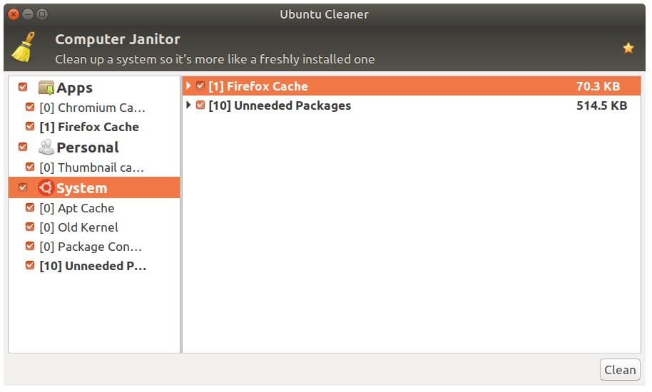

# Ubuntu Cleaner #


[](https://travis-ci.com/gerardpuig/ubuntu-cleaner)
[](https://coveralls.io/github/gerardpuig/ubuntu-cleaner?branch=master)



### Introduction ###
Ubuntu Cleaner is a tool that makes it easy to clean your Ubuntu system. Ubuntu Cleaner can free up disk space and remove private information from your computer.

- Clear browser cache
- Clear APT cache
- Clear thumbnail cache
- Remove unneeded packages
- Remove old kernels
- Remove old installers

### Installation ###
Installation via PPA:
```
$ sudo apt install software-properties-common
$ sudo add-apt-repository ppa:gerardpuig/ppa
$ sudo apt update
$ sudo apt install ubuntu-cleaner
```
Installation via .DEB (for unsupported Ubuntu versions only):
```
$ wget https://launchpad.net/~gerardpuig/+archive/ubuntu/ppa/+files/ubuntu-cleaner_1.0.4-1_all.deb
$ sudo apt install ./ubuntu-cleaner_1.0.4-1_all.deb
$ rm ubuntu-cleaner_1.0.4-1_all.deb
```
### Development ###
```
$ git clone https://github.com/gerardpuig/ubuntu-cleaner.git
```
To run the program from source:
```
$ ./ubuntu-cleaner
```
To run the unit tests:
```
$ make test
```
To create a .deb package:
```
$ make deb
$ make clean
```


### Related websites ###
* Blog <a href="http://ubuntu-cleaner.blogspot.com">http://ubuntu-cleaner.blogspot.com</a>.
* Launchpad <a href="https://launchpad.net/~gerardpuig/+archive/ubuntu/ppa">https://launchpad.net/~gerardpuig/+archive/ubuntu/ppa</a>.
